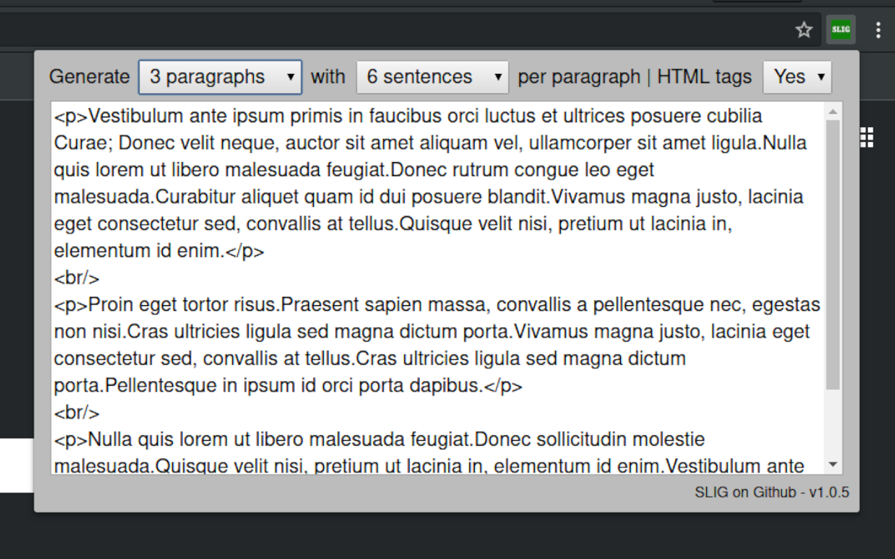
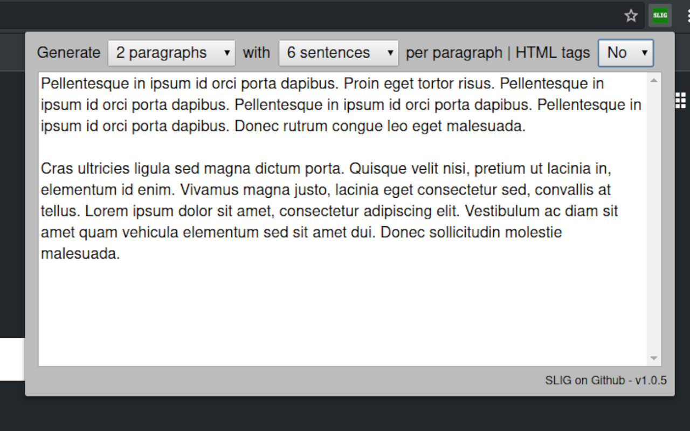

# Simple Lorem Ipsum Generator (SLIG)

A free, privacy-friendly browser extension to quickly generate customizable Lorem Ipsum text for your projects. SLIG is lightweight, open source, and syncs your preferences across browsers.

## Features

- Customizable output: choose the number of paragraphs and the length of each one
- Two length units: sentences or an exact word count per paragraph
- HTML support: optionally wrap each paragraph in a `<p>` tag
- No repeats: sentences are drawn without replacement, so a paragraph never says the same thing twice
- Copy to clipboard: one click, with a screen-reader announcement
- Remembers your settings: preferences sync across browsers
- Keyboard shortcut: `Alt+Shift+L` opens the popup
- Localized in English, French, German, Spanish, Italian, Portuguese (Brazil), Dutch and Polish, dark mode included
- Forever free: no paywalls, no tracking, no network access

## Installation

### From source (Chrome, Edge, Brave)

1. Download or clone this repository
2. Go to `chrome://extensions/` in your browser
3. Enable "Developer mode" (top right)
4. Click "Load unpacked" and select this project folder

### From source (Firefox)

1. Run `./build --firefox` to produce `dist/lipsum_generator-firefox.zip`
2. Go to `about:debugging#/runtime/this-firefox`
3. Click "Load Temporary Add-on" and select the zip

## Usage

1. Click the SLIG icon in your toolbar, or press `Alt+Shift+L`
2. Set the number of paragraphs and their length
3. Pick sentences or words as the length unit
4. Tick "HTML tags" to wrap each paragraph in `<p>`
5. Click Regenerate for new text, Copy to put it on the clipboard

## Screenshots

| Generator UI | Example Output |
|:---:|:---:|
|  |  |

## Development

Requires Node.js (pinned in `.tool-versions`) and pnpm (pinned in `package.json`).

```sh
pnpm install    # install the dev dependencies
pnpm lint       # biome lint
pnpm format     # biome format --write
pnpm test       # node --test, no browser needed
pnpm check      # biome check + tests, what CI runs
./build             # dist/lipsum_generator.zip
./build --firefox   # also dist/lipsum_generator-firefox.zip
```

Linting and formatting are both [Biome](https://biomejs.dev), configured in `biome.json`.

### Layout

| File | Role |
|---|---|
| `generator.js` | Pure text generation, no DOM and no extension API, fully unit tested |
| `browser.js` | Thin `chrome`/`browser` bridge plus the i18n helpers |
| `popup.js` | Wires the popup form to the generator and to synced storage |
| `_locales/` | Translations, referenced from the manifest and via `data-i18n` |
| `test/` | Generator tests plus manifest, icon and packaging checks |

Releases are cut by pushing a `vX.Y.Z` tag. CI refuses the tag if it does not match the version in `manifest.json`.

## Contributing

Contributions are welcome, see [CONTRIBUTING.md](CONTRIBUTING.md).

## License

This project is licensed under the terms of the [LICENSE](LICENSE).

## Support

- [Open an issue](https://github.com/d1ceward/lipsum_generator/issues) for bugs or feature requests
