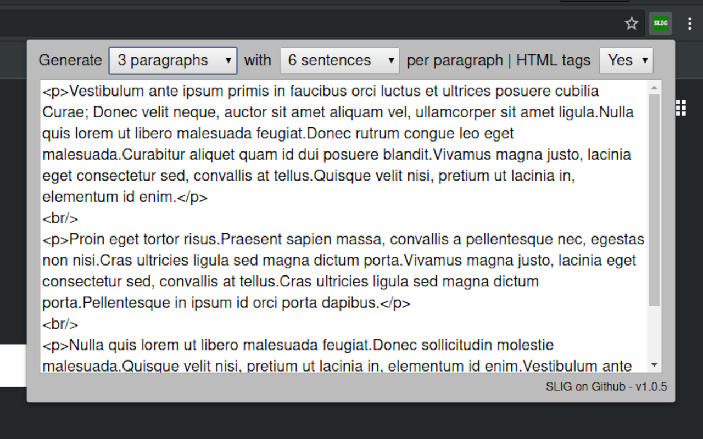

# Simple Lorem Ipsum Generator (SLIG)

A free, privacy-friendly Chrome extension to quickly generate customizable Lorem Ipsum text for your projects. SLIG is lightweight, open source, and syncs your preferences across browsers.

## Features

- **Customizable output:** Choose number of paragraphs and sentences per paragraph
- **HTML support:** Optionally wrap output in `
` and ` ` tags
- **Copy to clipboard:** One-click copy for easy pasting
- **Remembers your settings:** Preferences sync across Chrome browsers
- **Forever free:** No paywalls, no tracking, no nonsense

## Installation

1. Download or clone this repository
2. Go to `chrome://extensions/` in your browser
3. Enable "Developer mode" (top right)
4. Click "Load unpacked" and select this project folder

## Usage

1. Click the SLIG icon in your Chrome toolbar
2. Select the number of paragraphs and sentences
3. Choose whether to include HTML tags
4. Click **Regenerate** to create new text
5. Click **Copy** to copy the generated text to your clipboard

## Screenshots

| Generator UI | Example Output |
|:---:|:---:|
|  |  |

## Contributing

Contributions are welcome! To propose a change:

1. Fork this repository
2. Create your feature branch (`git checkout -b my-new-feature`)
3. Commit your changes (`git commit -am 'Add some feature'`)
4. Push to the branch (`git push origin my-new-feature`)
5. Create a new Pull Request

## License

This project is licensed under the terms of the [LICENSE](LICENSE).

## Support

- [Open an issue](https://github.com/d1ceward/lipsum_generator/issues) for bugs or feature requests
